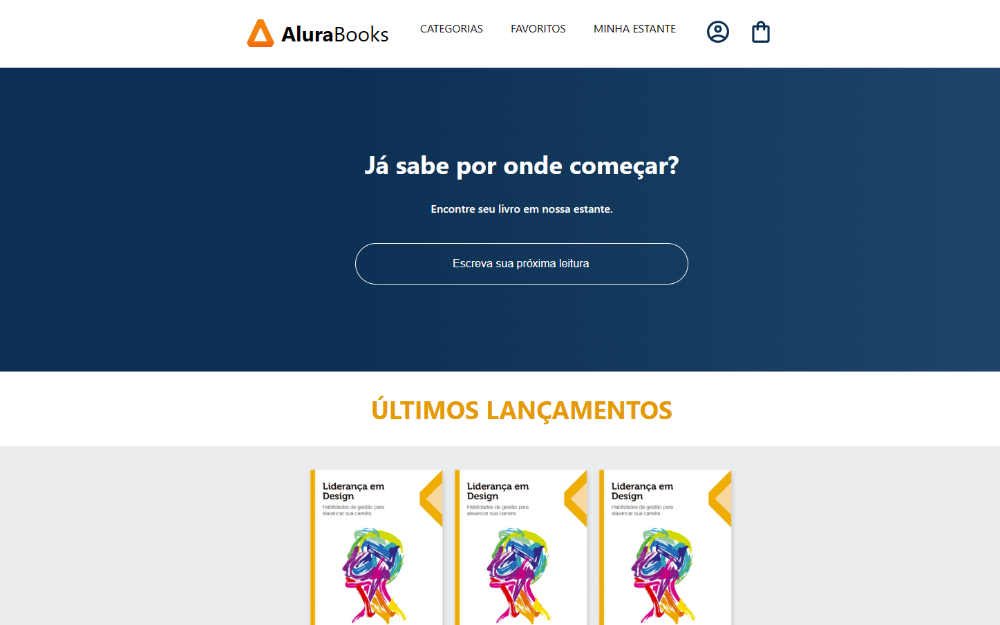

# Alura Books ✨

Este é um projeto desenvolvido durante o curso "React: comece seu projeto full stack" na plataforma Alura. O objetivo deste projeto é aplicar os conceitos aprendidos durante o curso, incluindo componentização, manipulação de estado, estilização com styled components e o uso de props.

## Sobre o Projeto 📚

O projeto Alura Books consiste em um site de livros onde os usuários podem buscar por livros disponíveis e visualizar informações detalhadas sobre cada um deles. O site inclui um header, um campo de busca e outros componentes para melhorar a experiência do usuário.

## Funcionalidades 🔍

- Busca de livros por título.
- Visualização de informações detalhadas sobre cada livro encontrado.

## Tecnologias Utilizadas 🧙‍♂️

- React v18.2.0
- Styled Components v6.1.8
- HTML
- CSS

## Instalação 🪄

Para executar este projeto localmente, siga as etapas abaixo:

1. Clone este repositório para o seu computador

2. Navegue até o diretório do projeto

3. Instale as dependências:
`$ npm install`

4. Inicie o servidor de desenvolvimento:
`$ npm start`

5. Abra o navegador e acesse `http://localhost:3000` para visualizar o projeto.

## Autores

- Rafael Rabelo da Silva (@rafaelrabelodasilva)

<!-- $ npx create-react-app .

npm install styled-components

Estado (valor mutável) -->